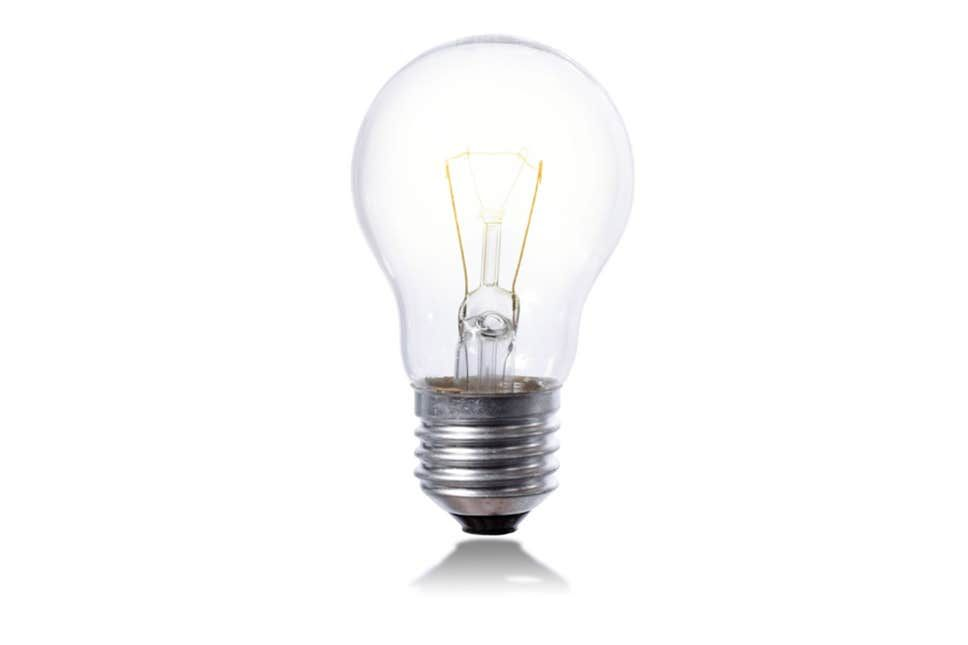
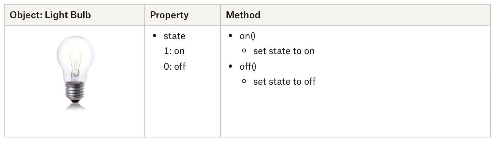

<!-- color: black -->

# AY2021 ID2116 Wk04: <br>Object,<br>Object Oriented Programming,<br>State Transition
<link rel="stylesheet" type="text/css" href="//fonts.googleapis.com/css?family=Nunito" />
<link rel="stylesheet" href="../css/slidetemplate.css">


# Schedule:

- Object Oriented Programming
    - JavaScript Object: 
    - Class
- Designing Behaviour of Algorithmic Agent
    - State Transition Diagram
   
- Connecting micro:bit ↔ p5*js 
    - Web USB
    <!-- - BlueTooth -->


# Mid-Term Project: ”Algorithmic Agent”

https://www.notion.so/clementzheng/Assignment-1-Algorithmic-Agent-b354abc36c2e42f6898a7dfd41c4fcc3


# [Object Oriented Programming](https://www.bbc.co.uk/bitesize/guides/zc8pjty/revision/3) with p5.js

BBC ByteSize: Object Oriented Programming
https://www.bbc.co.uk/bitesize/guides/zc8pjty/revision/3


## What is [Object](https://www.w3schools.com/js/js_objects.asp)?
 

## Object01: Light Bulb


<!-- 
Light Bulb is an Object.  
It has on/off state as a property.
It has methods like switchin on or off. 
or changing brightness or colour.

-->


## Object01: Light Bulb as a JavaScript Object 
https://editor.p5js.org/didny/sketches/o2xF4PK8f


```js

let bulb = {
  //key: value
  state: "off",

  on: function() {
    this.state = "on";
  },
  off: function() {
    this.state = "off";
  }
}

print(bulb.state); //"off"
bulb.on(); 
print(bulb.state); //"on"

```

<iframe style="width:401px; height:440px; margin: 191px 0px 50px 60%;" src="https://editor.p5js.org/didny/full/o2xF4PK8f"></iframe>


# JavaScript Object Notation
JavaScripts Objects are defined by key-value pairs.
A value can be a text, a number, a function, an object, etc.


```javascript
let fruit = {
  key : value, 
  name: "orange", //text
  weight: 100, //number
  weigh: function() { //function
            print( this.weight + "g")
         }   
}
```

# JavaScript Object: Dot Notation
The properties and methods of a JavaScript object can be referred by **ObjectName.key** notation which is called dot notation.


### 
```javascript
let val = fruit.name;          // val === "orange"
console.log(val)               // print out "orange"

fruit.weigh();         //calling fruit's weigh() method    

// printout "100g"
```


# JavaScript Object: [**this.**](https://www.w3schools.com/js/js_this.asp) keyword
In the declaration statement of a JavaScript object, <br>When referring to properties of the object itself, the **this** keyword must be used.
### 

```javascript
let bulb = {
  //key: value
  state: "off",

  on: function() {
    this.state = "on"; // update bulb.state to "on"
  },
  off: function() {
    this.state = "off"; // update bulb.state to "off"
  }
}

print(bulb.state); // "off"
print(this.state); // undefined

```

# But why do we need to use Object?

#
<iframe src="https://editor.p5js.org/didny/full/-BJXjiDEg"></iframe>

# Object Oriented Programming
### Abstraction
### Encapsulation
### Modularity
### Hierarchy


# [JavaScript Class](https://www.w3schools.com/js/js_classes.asp) <br>A template for creating objects: 

Class is  to generate an object (instance) from a template.  <br> By defining a Class of an object you can instantiate(spawn) the objects without rewriting the properties.  
 
 ## Class Example: Bulb Class

https://editor.p5js.org/didny/sketches/ZpW_tMZ0


<iframe class="p5" style="width=800px, height:800px" src="https://editor.p5js.org/didny/full/ZpW_tMZ0"></iframe>

## Object02: music player
### Let's list the properties and methods of the music player.
How can you describe the relationship of methods to properties?


## [Wk04 Exercise] Define a daily object as a JavaScript Object
- Analyze the everyday object you brought today and extract its properties and methods.
Write them down as a JavaScript object as the following example. 

```
    objectName = {
      property: "value",
      method: function() { "type what to do" }
    }
    
```

# Example: A Paper

    paper = {
      size: A4
      owner: Yuta
      color: "white"
      draw: function(scribble) {"draw a scriblle on the paper"}
      fold: function(time) { "fold the paper"}
      tear: function(num) { "teat the paper in to num of pices"}
    }


# Designing Behaviours of Objects


# State Transition / Finite State Machine
## STM01:  A Game Character
<style>
img[alt~="center"] {
  display: block;
  margin: 0 auto;
}
</style>


# 


## State Transition Diagram of Mr.Mario


<!-- ## Example2: Traffic Light


 -->

## STM02: Light Bulb State Transition


<iframe style="width:401px; height:440px; margin: 191px 0px 50px 60%;" src="https://editor.p5js.org/didny/full/o2xF4PK8f"></iframe>

#

<iframe src="https://editor.p5js.org/didny/full/aAzdj6k4"></iframe>

## STM03: p5*js Video Sequence Playback

https://editor.p5js.org/didny/sketches/aAzdj6k4


# Define and draw a state transition diagram for the Algorithm Agent
- Brainstorm ideas for your algorithmic agent. Make sure you review the [assignment brief](https://www.notion.so/clementzheng/Assignment-1-Algorithmic-Agent-d30a2d7cd96443a791446cf623aa23cf).
- Shortlist an idea.
- Plan out the states and transitions for your algorithmic agent idea.

- Draw a detailed state transition of your project idea. 
- Submit to Slack a PDF that includes:
    - A project description of the algorithmic agent (no more than 200 words).
    - Any relevant illustrations.
    - The state transition diagram of the algorithmic agent.


## Reference: 

- Coding Train: JavaScript Object
  - https://www.youtube.com/watch?v=-e5h4IGKZRY&&t=295s&ab_channel=TheCodingTrain


