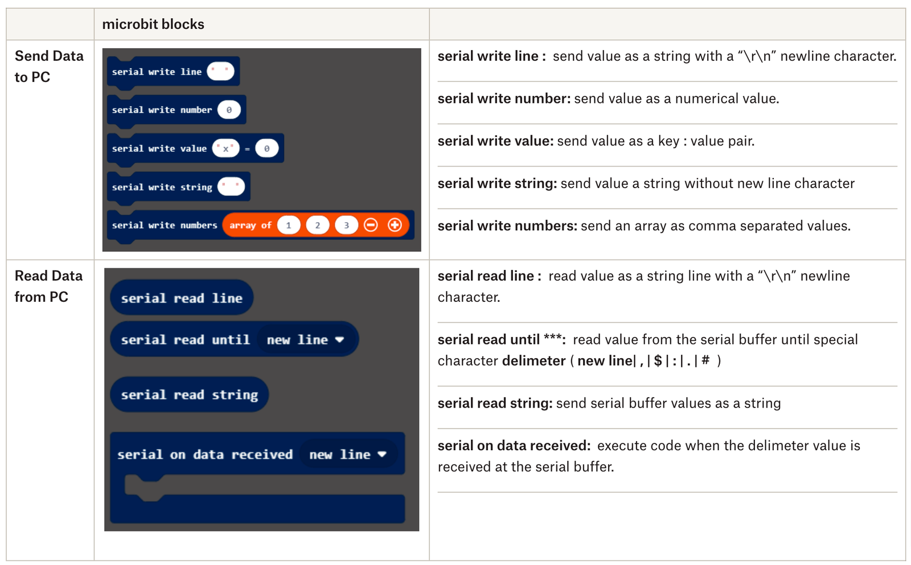
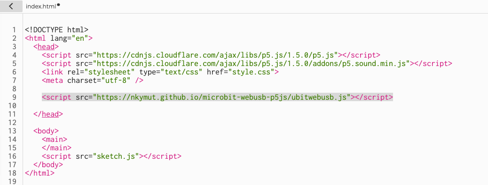
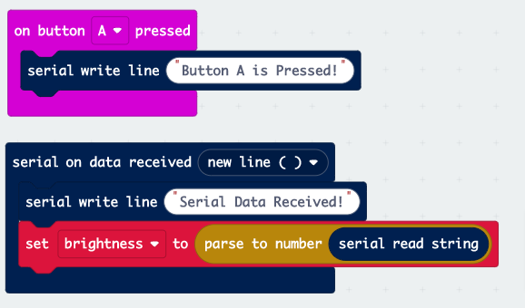
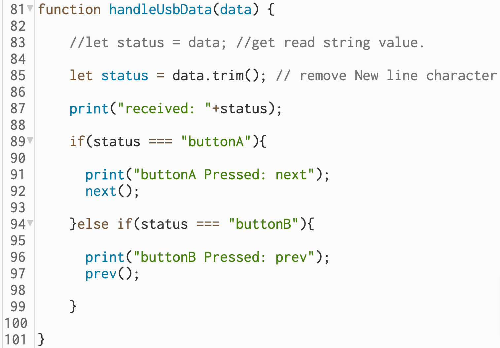

# AY2021 ID2116 Wk04:<br> micro:bit ↔ p5*js communication

<link rel="stylesheet" type="text/css" href="//fonts.googleapis.com/css?family=Nunito" />
<link rel="stylesheet" href="../css/slidetemplate.css">


<style>
img[alt~="center"] {
  display: block;
  margin: 0 auto;
}
</style>


<!-- 
## Index: 
- [[WebUSB] USB Serial Communication with micro:bit](https://paper.dropbox.com/doc/AY2021-ID2116-Wk04-microbit-p5js--BEjdzy0J3H41jkcMMEzCUsRdAg-l57LwqdvPUTBC8z6OcZ5b#:uid=986294029976971357443392&h2=[Wired]-USB-Serial-Communicati)
    - [[USB: micro:bit → p5*js]: Sending the light sensor value to p5*js](https://paper.dropbox.com/doc/AY2021-ID2116-Wk04-microbit-p5js--BEjdzy0J3H41jkcMMEzCUsRdAg-l57LwqdvPUTBC8z6OcZ5b#:uid=209110732840301520484819&h2=[USB:-micro:bit-%E2%86%92-p5*js]:-Send)  
    - [[USB: micro:bit → p5*js]: Control Image slideshow with micro:bit buttons](https://paper.dropbox.com/doc/AY2021-ID2116-Wk04-microbit-p5js-BEjdzy0J3H41jkcMMEzCUsRdAg-l57LwqdvPUTBC8z6OcZ5b#:uid=390056010812607083480264&h2=[USB:-micro:bit-%E2%86%92-p5*js]:-Cont)
    - [[USB micro:bit → p5*js] Sending multiple values to p5.js](https://paper.dropbox.com/doc/AY2021-ID2116-Wk04-microbit-p5js-communication--BGI~NeKpHqVXOzOXlqSKvnFbAg-l57LwqdvPUTBC8z6OcZ5b#:uid=342501432047763409484115&h2=[micro:bit-%E2%86%92-p5*js]-Sending-mu)
    - [[USB: p5.js → micro:bit] Control micro:bit LED with p5.js slider value](https://paper.dropbox.com/doc/AY2021-ID2116-Wk04-microbit-p5js-l57LwqdvPUTBC8z6OcZ5b#:uid=073453659660612340227947&h2=[USB:-p5.js-%E2%86%92-micro:bit]-Contr) 
    - [[USB: p5.js → micro:bit] p5.js microphone Input DEMO](https://paper.dropbox.com/doc/AY2021-ID2116-Wk04-microbit-p5js-l57LwqdvPUTBC8z6OcZ5b#:uid=390056010812607083480264&h2=[USB:-micro:bit-%E2%86%92-p5*js]:-Cont)
- [[BLE] Bluetooth Communication with micro:bit](https://paper.dropbox.com/doc/AY2021-ID2116-Wk04-microbit-p5js-BEfMpJQEahhFVcNFe8Bh8QdNAg-l57LwqdvPUTBC8z6OcZ5b#:uid=193768567320079085890174&h2=[Wireless]-Bluetooth-Comunicat)
    - [[BLE: micro:bit → p5*js]: Control video playback with micro:bit gesture.](https://paper.dropbox.com/doc/AY2021-ID2116-Wk04-microbit-p5js-l57LwqdvPUTBC8z6OcZ5b#:uid=559370689815783445110947&h2=[BLE:-micro:bit-%E2%86%92-p5*js]:-Cont)
    - [[BLE: micro:bit → p5*js]: Control Image Slideshow with micro:bit buttons](https://paper.dropbox.com/doc/AY2021-ID2116-Wk04-microbit-p5js-l57LwqdvPUTBC8z6OcZ5b#:uid=156783111641616534686400&h2=[BLE:-micro:bit-%E2%86%92-p5*js]:-Cont) -->

# micro:bit ↔ p5*js communication libraries

micro:bit has two communication modes, wired WebUSB and wireless WebBluetooth, and you can access them from p5.js using the following libraries.

<br>

|protocol|p5.js library|type
|--|--|--|
|WebUSB| [https://nkymut.github.io/microbit-webusb-p5js/](https://nkymut.github.io/microbit-webusb-p5js/)|Wired|
|WebBluetooth|[https://nkymut.github.io/microbit-webble-p5js/](https://nkymut.github.io/microbit-webble-p5js/)|Wireless|


# [WebUSB] USB Serial Communication with micro:bit
### → Serial Communication

“The [serial](https://makecode.microbit.org/reference/serial) supports [serial communication](https://en.wikipedia.org/wiki/Serial_port) between the BBC micro:bit and another computer. Basically, this allows you to send data from the micro:bit to your own computer. This is very useful for debugging purposes: you can add `write line` statements in your code and see them display on your computer as the program executes.”
  
  https://makecode.microbit.org/device/serial

# micro:bit Serial blocks
**https://makecode.microbit.org/reference/serial**


 |a|a|
 |-|-|
 |a|a|



# p5js WebUSB library
[https://nkymut.github.io/microbit-webusb-p5js/](https://nkymut.github.io/microbit-webusb-p5js/)


# [USB: micro:bit → p5js]:<br> Sending the light sensor value to p5*js  
Now, let’s control a p5*js sketch (Bulb) using the light sensor data from the micro:bit. 

micro:bit code: https://makecode.microbit.org/_FpAhTu5mA2jF

p5*js code: https://editor.p5js.org/didny/sketches/_P18rzj9 


#
<iframe allow="usb" src="https://editor.p5js.org/didny/full/_P18rzj9"> </iframe>

 
## Step 01: Load Serial_LightSensor code to micro:bit** 

**Serial_LightSensor:  https://makecode.microbit.org/_FpAhTu5mA2jF**


## Step:02:  Load WebUSB Library to p5*js

<!-- 1-1. Download the micro:bit WebUSB Library
[https://nkymut.github.io/microbit-webusb-p5js/ubitwebusb.js](https://nkymut.github.io/microbit-webusb-p5js/ubitwebusb.js)
    
1-2. Upload “ubitwebusb.js” file to the sketch folder of [the LightBulb Code](https://editor.p5js.org/didny/sketches/lNbPXn-QZ).
**p5js code: https://editor.p5js.org/didny/sketches/lNbPXn-QZ**

 -->

1. Open “index.html” from Sketch Files:  and add following line above “sketch.js” link.
This will allow p5 to use the micro:bit webusb library.

```html
  <script src="https://nkymut.github.io/microbit-webusb-p5js/ubitwebusb.js"></script>
```

  
<!-- 
## Step:03:  Load webUSB Library to the p5*js** 

1. Open “index.html” from Sketch Files:  and add following line above “sketch.js” link.
This will allow p5 to use the micro:bit webusb library. 

```
<script src="ubitwebusb.js"></script>
```

 -->

## Step:03:  Setup WebUSB Library

 After setting up the library, instantiate a uBitWebUSB object on the micro:bit declared in the p5 global variable.

```js
  let microBit; //global variable

  microBit = new uBitWebUSB(); //create microBit WebUSB instance
```   

## Step:04:  Add “Connect”/”Disconnect” Buttons.
Next, create buttons for connecting/disconnecting to the micro:bit.

```js
/* Inside setup()*/
//add connect button
connectBtn = createButton("connect");
connectBtn.mousePressed(function(){microBit.connectDevice();});

//add disconnect button
disconnectBtn = createButton("disconnect");
disconnectBtn.mousePressed(function(){microBit.disconnectDevice();});
```

## Step:05:  Add “Connect”/”Disconnect Callback functions.

```js
  //inside setup() function.

  //onConnect happens when microBit is connected.
  microBit.onConnect(function(){
    console.log("connected");
  });

  //onDisconnect happens when microBit is disconnected.
  microBit.onDisconnect(function(){
    console.log("disconnected");
  });

```
<!-- 
 -->

## Callback Function





```js  
//happens when a mouse button is pressed.
function mousePressed() {
  //switch on the bulb
  bulb.on();
}

//happens when a serial data is received.
microBit.onReceiveSerial(
   function(receivedData){
    let val = int(receivedData);
    bulb.brightness = val;
    
    fadeSlider.value(bulb.brightness);
  });
```


## Step:06:  Add callback function to handle incoming data from micro:bit

-`microBit.onReceiveSerial()` sets what to do when data is received from the micro:bit via Serial communication.

The code below sets the light sensor data received vis UART to the brightness value of the bulb object.


```js

  microBit.onReceiveSerial( // set receive Serial callback
    function(receivedData) {　
      let val = int(receivedData); //convert the received text to a number
      bulb.brightness = val; //change bulb brightness
    
      fadeSlider.value(bulb.brightness); //display brightness on fader
    }
  );

```

# Data conversions in p5

[**int(data)**](https://p5js.org/reference/#/p5/int)  converts incoming “string” data to numerical integer value. 


p5.js has the following data conversion functions.


[int()](https://p5js.org/reference/#/p5/int) : text to integer &ensp;&ensp;&ensp;&ensp;&ensp;&ensp;&ensp;&ensp;&ensp;&ensp;&ensp;&ensp;"0" -> 0
[float()](https://p5js.org/reference/#/p5/float) : text to float number &ensp;"0.5" -> 0.5
[str()](https://p5js.org/reference/#/p5/float) : number to text &ensp;&ensp;&ensp;&ensp;&ensp;&ensp;&ensp;&ensp;&ensp;&ensp;&ensp;&ensp;0.5 -> "0.5"
[boolean()](https://p5js.org/reference/#/p5/float) : text to boolean &ensp;"true" -> true


# Challenge:  Turn the Bulb into  a Sensor Light


### Add a conditional statement in the handleData()<br>  so that the light turns on when the brightness drops below 20, and turns off when it exceeds 20.


<!-- **Send various Sensor values:**  https://makecode.microbit.org/_KJ04jUgi94zd -->

<!-- video of webUSB https://www.dropbox.com/s/n8nb4xnn4prgxbu/AllSensorDemo.mp4?dl=0 -->


## [USB: micro:bit → p5*js]: Control Image slideshow with micro:bit buttons

**micro:bit code: https://makecode.microbit.org/_9RM9kW60zFjK**
**p5*js code:** https://editor.p5js.org/didny/sketches/vRopIXHjq


| **micro:bit code**                                                                                                                                                  | **p5.js code**                                                                                                                                                      |
| ------------------------------------------------------------------------------------------------------------------------------------------------------------------- | ------------------------------------------------------------------------------------------------------------------------------------------------------------------- |
|  |  |

<!-- **JavaScript trim()** method: https://www.w3schools.com/jsref/jsref_trim_string.asp -->

# Image Slideshow

<iframe allow="usb" src="https://editor.p5js.org/didny/full/vRopIXHjq"> </iframe>


## [USB: p5.js → micro:bit] Control micro:bit LED with p5.js slider value 

**microbit code:** https://makecode.microbit.org/31374-29890-38666-61410
**p5*js code:** https://editor.p5js.org/didny/sketches/CoIoFM3B


 
 

#

<iframe allow="usb" src="https://editor.p5js.org/didny/full/CoIoFM3B"> </iframe>

## [micro:bit → p5*js] Sending multiple values to p5.js
<!--  -->

**micro:bit code:** https://makecode.microbit.org/_Pv4YdyaA0hv9
**p5.js code:** https://editor.p5js.org/didny/sketches/oqxTQ1h1

#
<iframe allow="usb" src="https://editor.p5js.org/didny/full/oqxTQ1h1"> </iframe>


# Handling Comma Seperated Value

- [split(",");](https://www.w3schools.com/jsref/jsref_split.asp) : splits a string value into array of substrings

- [map(val, input_min, input_max, target_min, target_max);](https://p5js.org/reference/#/p5/map) : re-map input value range to another value range. 


#  [micro:bit] Sending multiple values to p5.js
Serial communication can only send a single text, so multiple numbers need to be sent as a taxt separated by commas.

step1: read accelerometer values to variables 
 R ← X axis , G ← Y axis ,B ← Z axis   

step2: Join variables into a single line text and send via Serial  
- Join R +“,” + G + “,” + B 
- creates a text line “R,G,B” 
- e.g. “128,255,1023”                                                                                                                                               |

  

#  [p5] [split()](https://www.w3schools.com/jsref/jsref_split.asp) comma seperated value


Step01: p5.js receives data from micro:bit as a string “R,G,B”  

```js
function handleData(data){ 
  print(data);  // text data “600,350,800\n” 
}
```
Step02: split text string by “,”(comma) delimiter and convert text into an array of integer values. 

 ```js
  values = data.split(","); // split data with comma 
  values = int(values);     //convert to number(integer)
  print(values);            // print ["600", "350", "800"]
 ```

#  [p5] [map()](https://p5js.org/reference/#/p5/map) sensor data
Since some of the micro:bit's accelerometer  returns values between **-1023 and 1023**
In order to use these as p5 color data, we need to set our range to **0-255**.
To do this, we will use the map() function.

**map(value, min, max, target_min, target_max)**


```js
  //map value range from microbit's accelerometer(-1023,1023) to RGB color(0,255)
  //and assign values to RGB color variables. 
  R = map(value[0],-1023,1023,0,255);
  G = map(value[1],-1023,1023,0,255);
  B = map(value[2],-1023,1023,0,255);
``` 
<!--    -->

## Algorithmic Agent Example (from AY2021)

### GABRIELLA EDITH TAN RUI,RAIN TAY XIN YU,WONG YU TING ASHLYN 

##


<iframe width="560" height="315" src="https://www.youtube.com/embed/fzV1dl7LCEM" title="YouTube video player" frameborder="0" allow="accelerometer; autoplay; clipboard-write; encrypted-media; gyroscope; picture-in-picture" allowfullscreen></iframe>

##

state transition diagram:
https://www.dropbox.com/s/yeap6x49z5zbp58/BunnySTM.pdf?dl=0
p5js: https://editor.p5js.org/didny/sketches/O2vmLoa86
micro:bit: https://makecode.microbit.org/_hcC6eUDRY79j


##
<iframe allow="usb" src="https://editor.p5js.org/didny/full/O2vmLoa86"></iframe>


## 
<iframe src="./assets/BunnySTM.pdf" > </iframe>


<!-- ## [p5.js → micro:bit] p5.js microphone Input DEMO

https://editor.p5js.org/didny/sketches/1lPD89fXB
<iframe allow="usb" class="p5" src="https://editor.p5js.org/didny/full/1lPD89fXB"></iframe>

 -->


<!-- # p5*js Communication libraries: 
- WebUSB Library:  https://github.com/bsiever/microbit-webusb
    - p5*js sample: https://github.com/nkymut/microbit-webusb-p5js
- Bluetooth Library: https://antefact.github.io/microBit.js/ -->

# Challenges

### Emoji Agent: https://editor.p5js.org/didny/sketches/KWquYAjGF

### 1. Add the microbit USB serial communication code to the emoji agent code, and Feed the Emoji Agent.

### 2. Find a way to interact with the Emoji Agent by combining the daily items you brought today with the micro:bit sensors, and try to implement it.

### 3. Build a DIY sensors from the Electronics As Material module and connect it with micro:bit through pin block. 
https://github.com/clementzheng/Electronics-As-Material
https://makecode.microbit.org/reference/pins


# References

### p5.js WebUSB library 
https://github.com/bsiever/microbit-webusb

**sample codes  https://github.com/nkymut/microbit-webusb-p5js**

### 

<!--     
# Assignments:
## [Wk04 Assignment 02] Experiment with micro:bit + media player interaction.
- By modifying p5*js ← → micro:*bit samples, try implementing some (or all) of your state transitions. 
    - e.g.  (A Butterfly Hovering) →  clap your hand → (A Butterfly Flies away)   -->


