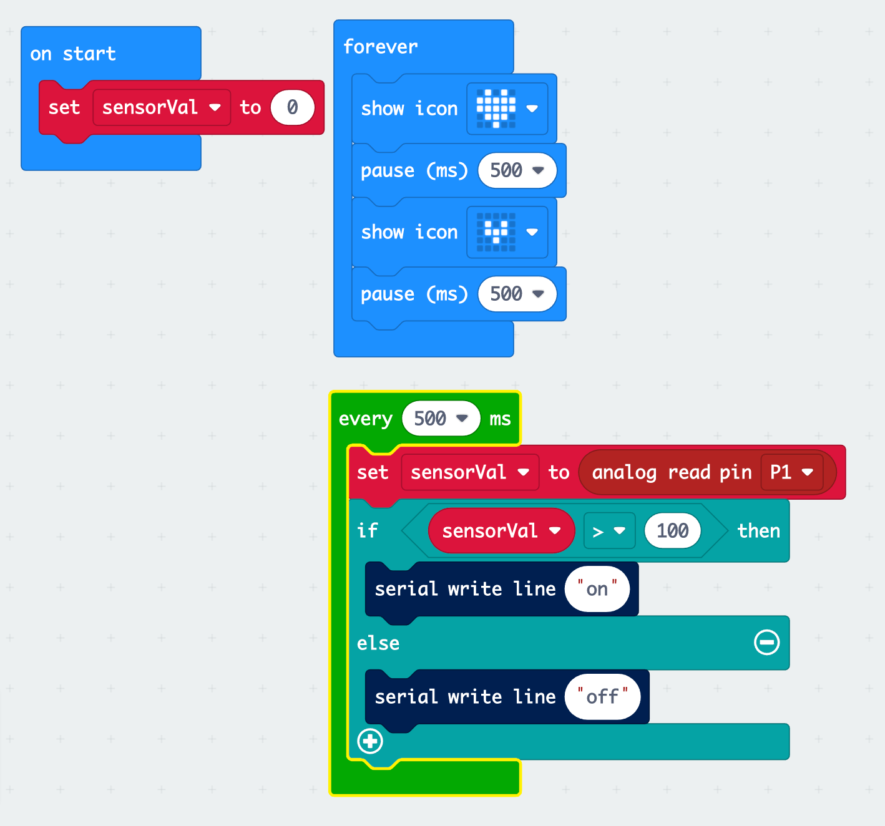

<!-- color: black -->


#  ID2116 Wk05:<br> micro:bit I/O

<link rel="stylesheet" type="text/css" href="//fonts.googleapis.com/css?family=Nunito" />
<link rel="stylesheet" href="../css/slidetemplate.css">


#  Schedule

- [micro:bit I/O Pins]() 
  - Digital Input
  - Analog Input
  - Programmable LED (Neopixel)

- Consultation: Algorithmic Agent Project 


#   Materials

- Crocodile Clip to Pin cable
- Pin to Pin cable
- Pin to Socket cable
- Neopixel

- Copper Tape
- 10k Ohm Resistor  x 2 7
- Velostat


<!-- 
 -->


#  micro:bit GPIO pins<br>

(General Purpose Input/Output)

- Edge connector
GPIO x 17<br>- 2/3 reconfigurable PWM outputs<br>- Croc-clip connectors x 5<br>- Analog In x 6<br>- max 90mA 


# micro:bit <br>Pins Blocks
 

https://makecode.microbit.org/reference/pins


# connecting wires with micro:bit

- Crocodile Clip
- Edge Connector + Breadboard
- [Through the Holes <br>(Bolts & Nuts)](https://lorrainbow.wordpress.com/2017/11/11/how-to-connect-wires-to-the-microbit/)


#  Edge Connector + [Breadboard](https://learn.sparkfun.com/tutorials/how-to-use-a-breadboard) 
[micro:bit extension board](https://detail.tmall.com/item.htm?id=582031537281&spm=a1z09.2.0.0.cc702e8dCcvFJ4&_u=j1lbbh1jf6d6)


#   [Hands-On] DIY Sensors + micro:bit


#   01:  Button 

[Electronic As Material#Button](https://github.com/clementzheng/Electronics-As-Material#Button) 


**micro:bit code:** https://makecode.microbit.org/_4gsCV906TC2p


# Digital Read / On Pressed 

<!-- 
<div style="position:relative;height:0;padding-bottom:70%;overflow:hidden;"><iframe style="position:absolute;top:0;left:0;width:100%;height:100%;" src="https://makecode.microbit.org/#pub:_ALs9iEPpjE1c" frameborder="0" sandbox="allow-popups allow-forms allow-scripts allow-same-origin"></iframe></div> -->
<div style="position:relative;height:calc(300px + 5em);width:100%;overflow:hidden;"><iframe style="position:absolute;top:0;left:0;width:100%;height:100%;" src="https://makecode.microbit.org/---codeembed#pub:_ALs9iEPpjE1c" allowfullscreen="allowfullscreen" frameborder="0" sandbox="allow-scripts allow-same-origin"></iframe></div>

# Digital Read w/ Internal Pull Up/Down
Using the Micro:bit's built-in [pull-up and down resistor](https://makecode.microbit.org/reference/pins/set-pull) functions, you can create buttons without connecting any external resistors.

<div style="position:relative;height:calc(300px + 5em);width:100%;overflow:hidden;"><iframe style="position:absolute;top:0;left:0;width:100%;height:100%;" src="https://makecode.microbit.org/---codeembed#pub:_huwHX4HUbRip" allowfullscreen="allowfullscreen" frameborder="0" sandbox="allow-scripts allow-same-origin"></iframe></div>


#  Toggle States with Button


 


#   02: Pressure Sensor
 
[Electronic As Material#Pressure Sensor](https://github.com/clementzheng/Electronics-As-Material#pressure-sensor)

- [Velostat](https://learn.adafruit.com/firewalker-led-sneakers/make-velostat-step-sensors)


---


#  Analog Read/Write:  Variable Resistor

micro:bit code: https://makecode.microbit.org/_coMPRfgWc2si


   


# Reading sensor values at regular intervals.

micro:bit code: 
https://makecode.microbit.org/_gVaijAWWcUrx

 


<!-- ---

## (Referece) <br>Digital Write: <br>Blinking an LED

    -->
<!-- 
---


---


---


---


---


---


#  Button Input

  

 

---


---


--- -->


# 03: Programmable LED Strip (Neopixel) 

- [NeoPixel Tutorial](https://learn.adafruit.com/micro-bit-lesson-3-neopixels-with-micro-bit)
- [NeoPixel Reference](https://makecode.microbit.org/pkg/microsoft/pxt-neopixel)


##  Enabling Neopixel extension for micro:bit

- **Note: Neopixel Library cannot be used together with Bluetooth Library**. 
<!-- https://www.youtube.com/watch?v=Z55bTWKkooQ& -->


<!-- [https://youtu.be/Z55bTWKkooQ](https://youtu.be/Z55bTWKkooQ) -->


## 03-01 Connect NeoPixel to micro:bit:

|neopixel|  micro:bit|
| - |-|
|GND|           GND    |   
|DI    |        P0  |          
|+5v    |       3V3   |

  


## 03-02 Neopixel Test Code
micro:bit code: https://makecode.microbit.org/_YEhYEcd7b0aF


# 04 [p5*js -> micro:bit] <br>Control Neopixel from p5.js  


##   04-01: sample codes


micro:bit code: https://makecode.microbit.org/83044-76777-39165-56605
p5.js code: https://editor.p5js.org/didny/sketches/cTFjpyKd


<!-- -
---


 -->


# p5*js Code:  Sending multiple values
     


sliderInput() function reads slider values and format data using “,” comma as delimiter. . <br>
e.g.  if(R=127 G=127 B=127) <br>
send() function sends the data as a string with new line character . <br>
        sendData = “127,127,127\n” 


# micro:bit: Receiving multiple values


- [serial on data received] will be called when new line “\n” character is received into micro:bit's Serial buffer. <br><br>
- (serial read until ‘,’) block :
 retrieve string value before the “,”  and (parse to number) converts string val to numerical value.<br>      <br>   


# Decomposing comma seperated messages 
 ```js
  Serial Buffer: “127, 127,127\n”  

           “127, 127,127\n”  
        　　　　　　↓　//read until “,”
             R = float(“127”) 

              “127,127\n”
        　　　　　　↓  //read until “,”
             G = float(“127”)  

                “127\n” 
        　　　　　　↓  //read until “\n”
             B = float(“127”) 

            
   Serial Buffer: “”   
```


# 05 Updating Agent states from micro:bit

---

microbit code: 
https://makecode.microbit.org/_RiFTMKbEcXyX

p5.js code:
https://editor.p5js.org/didny/sketches/J5QhGO9TB


<iframe style="width:401px; height:470px; margin: 191px 0px 50px 60%;" src="https://editor.p5js.org/didny/full/J5QhGO9TB"></iframe>


## 05-01 Handling Actions

```js
function handleData(data){
 
  // set incoming message to actionVal
  let actionVal  = data.trim(); 
  
  print("received:", actionVal);

  // check incoming action

  if(actionVal == "feed"){ 
    feed();   // call "feed" action
  }

}
```


## 05-02 [p5.play](https://molleindustria.github.io/p5.play/) Animation and Sprite

With the [p5.play](https://molleindustria.github.io/p5.play/) library, you can easily create animatated character objects with multiple display states. 
By loading an animation consisting of a sequence of images into a sprite object with a label, it is possible to specify the animation by label.

https://molleindustria.github.io/p5.play/examples/index.html?fileName=sprite3.js

---


<iframe src="https://molleindustria.github.io/p5.play/examples/index.html?fileName=sprite3.js"></iframe>

```js
var ghost; //a sprite object
function setup() {
  createCanvas(800, 300);

  //create a sprite and add the animations
  ghost = createSprite(400, 150, 50, 100);

  //label, first frame, last frame
  //the addAnimation method returns the added animation
  //that can be store in a temporary variable to change parameters
  var myAnimation = ghost.addAnimation('floating', 'assets/ghost_standing0001.png', 'assets/ghost_standing0007.png');
}

function draw() {
  if(ghostSate == "floating"){
    //set "floating" animation to show
    ghost.changeAnimation('floating');
  }
  //draw the sprite
  drawSprites();
}
```
<span>


<span>


## 05-03 Loading animations with p5.play 1/2

1. declare variables to store p5.play animation and sprite 

2. load animations using loadAmination()


## 05-04 Loading animations with p5.play 2/2
3. create a [Sprite](https://molleindustria.github.io/p5.play/docs/classes/Sprite.html) to draw a character, 
and set animations to the sprite using "state" labels with [addAnimation()](https://molleindustria.github.io/p5.play/docs/classes/Animation.html).


3. update sprite animation by label and display. 


## Setting up [p5.play](http://molleindustria.github.io/p5.play/)
<!-- 1. Download [p5.play.js](https://raw.githubusercontent.com/molleindustria/p5.play/master/lib/p5.play.js) and upload the .js file to the p5 web editor -->
   
1. Add following lines to “index.html” to enable p5.play.js.

```html
   <script src="https://cdn.jsdelivr.net/npm/planck@latest/dist/planck.min.js"></script>
   <script src="https://p5play.org/v3/p5.play.js"></script>
```

## more resources on p5.play

#### How to load animations
https://p5play.org/learn/sprite_animation.html

#### p5.play examples
https://molleindustria.github.io/p5.play/examples/index.html


# Resources for AA Assignment

<!-- 
<br><br>          

--- 
 -->

<!-- 

# [micro:bit → p5*js] Send multiple values to p5.js


micro:bit code: https://makecode.microbit.org/_Pv4YdyaA0hv9
p5.js code: https://editor.p5js.org/didny/sketches/oqxTQ1h1


---

micro:bit code
  
  step1: read accelerometer values to variables<br> R ← X axis<br> G ← Y axis<br> B ← Z axis<br> <br> step2: join variable into a “Comma Separated  Value ” and send via Serial <br>- Join R +“,” + G + “,” + B<br>    - creates a text line “R,G,B”<br>        - e.g. “128,255,1023” 

---
## p5.js code                

   

```
    - Step01: p5.js receives data from micro:bit as a string “R,G,B” <br><br>- e.g “600,350,800”<br><br>
    - Step02: split text string by “,”(comma) delimiter and convert text into an array of integer values.<br><br>- value = [600, 350, 800];<br><br>
    - Step03: map value range from micro:bit’s accelerometer range (-1023 ~ 1023) to RGB color range (0~255)<br><br>
    - Step04: assign values to the background color (R, G , B ) and adjust slider position. 
``` -->


<!-- 
#   Sensors


--- 

Digital Inputs: on/off

Sensor               Output       

Button / Switch          digital (on/off) 
Photo Interrupter        digital (on/off) 
Capacitive Touch Sensor  digital (on/off) 

---

Analog Inputs: 

Sensor                                    Output
 - 
Variable Resistor                             Resistance                            
bend sensor / pressure sensor / touch slider  Resistance                            
Light Sensor：<br>　CDS / PhotoDiode            CDS: Resistance / PhotoDiode: Current 
Temperature Sensor                            Voltage ()                            
Infra-Red Range Finder                        Voltage (0~Vcc)                       

Digigal Signal Inputs: PWM, UART, I2C, 

Sensor                     Output 
---  -- 
[Ultra-sonic Range Finder](https://osoyoo.com/2018/09/18/micro-bit-lesson-using-the-ultrasonic-module/)             
[Liquid Flow sensor](https://www.instructables.com/How-to-Use-Water-Flow-Sensor-Arduino-Tutorial/)                  
 -->

<!-- 
# Using gif animation 

### p5.gif.js library
https://github.com/antiboredom/p5.gif.js/tree/master

download: [p5.gif.js](https://raw.githubusercontent.com/antiboredom/p5.gif.js/master/p5.gif.js)

```js
var gif;

function setup() {
  createCanvas(600,600);
  gif = loadGif('mygif.gif');
}

function draw() {
  background(0);
  image(gif, 0, 0);
}
```

## Setting up [p5.gif.js](https://github.com/antiboredom/p5.gif.js/tree/master)
1. Download [p5.gif.js](https://raw.githubusercontent.com/antiboredom/p5.gif.js/master/p5.gif.js) and upload the .js file to p5 web editor

2. Add a following line to “index.html” to enable p5.gif.js.

```html
    <script src="./p5.gif.js"></script>
```
 -->

# Touch Sensor (micro:bit v2 only)

- Touch sensing on the micro:bit
https://support.microbit.org/support/solutions/articles/19000116318-touch-sensing-on-the-micro-bit
- Touch Sensor tutorial using Conductive Paint. 
"https://www.bareconductive.com/blogs/resources/how-to-create-a-touch-sensor-for-the-micro-bit-with-electric-paint" 


#   Servo/Actuators

- Servo:
https://support.microbit.org/support/solutions/articles/19000101864-using-a-servo-with-the-micro-bit

- Driving Motor: 
  - [motor driver board](https://www.sgbotic.com/index.php?dispatch=products.view&product_id=2349)


#   Where to purchase electrical components / tools
  - [SimLim Tower](https://goo.gl/maps/ogRAr24sCyyadJqW9)
      - B1: [Continental Electronics](https://www.continental.sg/)
      - 2F: [Amicus](http://amicus.com.sg/)
      - 3F: [SunLight](http://www.sun-light.com.sg/)
  - [SGBotic](https://www.sgbotic.com/) ( ~3day)
  - [RS Components](https://sg.rs-online.com/web/) / [Element 14](https://sg.element14.com/)  (3days ~ 1week)
  - [DF Robot](https://www.dfrobot.com/) / [Seeedstudio](https://www.seeedstudio.com/) (From China: 1 ~ 2 week)
  - [SparkFun](https://www.sparkfun.com/) / [Adafruits](https://www.adafruit.com/) (From US: 2~3 week)
  - TaoBao / AliExpress 

<!-- ---

#  Part 2: Teapot: Proof of Concept Prototyping Example:


---

#   Step1 : Object Analysis / Modelling
Object Property               Method / Action         
---

<br><br><br>[Teapot](https://www.ikea.com/sg/en/p/riklig-teapot-glass-30163217/)  - status<br>    - Filled<br>    - Empty<br>    - Lift<br>    - Placed<br>    - Pouring<br>    - Tilt<br>- content<br>    - type of drink<br>    - temperature<br>    - amount  - fill()<br>- pour()<br>- grab()<br>- release()<br>- tilt()<br>- openRid()<br>- closeRid()<br>- rub() 

---

#   Step2: State Transition Diagram
https://docs.google.com/drawings/d/1DOIVD8RCDSE4rbYBScM6p-EV9b3wqDEane0hbzVCTGE/edit?usp=sharing

--

#   Step3: Consider Potential System Design: 

#      [hardware] How can we “sense” these state transitions?
  -  Empty → Filled : sense presence of water
      - By Weight                 → weight sensor  : only usable when the pot is Placed
      - By Detecting Water → capacitive water level sensor : directly measure water level.
 → light sensor : check water level by light intensity through the pot.
   → water sensor :  add electrical contact to detect presence of water.
  - Placed → Lifted: sense movement of the pot
      - Push Button → by pressure
      - Light Sensor → add light sensor at the bottom
      - Touch Sensor → sense if the handle of the pot is grabbed
      - Accelerometer → sense vertical movement
  - Lifted ↔ Pouring : sense tilt angle and direction of the pot
      - Accelerometer → sense pitch/yaw angle
      - Tilt Sensor → sense tilt movement
--

#   Step4:  Generating “New” switch ideas:  “What if”s 

What if:  a plant grows as you pour your drink?

https://www.youtube.com/watch?v=LcixBmtvddo&


[https://youtu.be/LcixBmtvddo](https://youtu.be/LcixBmtvddo)


--

#   Step5:  Draw STM sequence of the “New” Switch Idea
Object  Property             Method  Mapping                      
--  ---  --   
Plant       type<br>growth<br>speed  grow()      teapot.pour() → plant.grow() 


https://docs.google.com/drawings/d/1R_jzBfG4cAqiHAJ81Jn3tgYgQiLZYNNsbr_OMIQI2FY/edit?usp=sharing


[https://docs.google.com/drawings/d/1R_jzBfG4cAqiHAJ81Jn3tgYgQiLZYNNsbr_OMIQI2FY/edit](https://docs.google.com/drawings/d/1R_jzBfG4cAqiHAJ81Jn3tgYgQiLZYNNsbr_OMIQI2FY/edit)

--

#   Step4: Decide Specification by selection → eliminating unnecessary elements.

#      [hardware] How can we “sense” these state transitions?  


  -  ~~Empty → Filled : sense presence of water~~
  - Placed → Lifted: sense movement of the tea pot
      - Touch Sensor → sense if the handle of the pot is grabbed
      - ~~Accelerometer → sense vertical movement~~
  - Lifted ↔ Pouring : sense tilt angle and direction of the pot
      - Accelerometer → sense pitch/yaw angle
      - ~~Tilt Sensor → sense tilt movement~~
      
https://docs.google.com/drawings/d/1OiAUGmFSw9xsmUxJSXjq_raBG99mvS2Ua1Ikpec4pBc/edit?usp=sharing

            Hardware              Data Range                                  
---    --- 
MCU      micro:bit                            
Power    USB Powerbank                        
Sensors  Touch Sensor module       0 / 1
            accelerometer (rotation)  pitch: -90 ~ 90 degree<br>roll: -90 ~ 90 degree 

--

#   Step6: Develop Proof of Concept prototype


--

#   Step7: Dump Sensor values and Observe sensor value ranges. 


https://makecode.microbit.org/_RjH44jHfu7Az

https://www.dropbox.com/s/6ank3n9lgy8ljv4/PouringAction.mp4?dl=0


--

#   Step8: Create mapping of  Sensor Value ↔ States
TeaPot State  Sensor Values
  
Placed            touchsensor : 0                                  
Lifted            touchsensor:  1<br>accelerometer(pitch):  >= -40 
Pouring           pitch angle < -40                                


#   Step9: Implement the TeaPot State Machines on micro:bit
https://makecode.microbit.org/_8kteAURYpig1

microbit Teacup State Machine

                                  

#   If TouchSensor is touched AND pitch angle < -40  → send “Pouring” to p5<br>
#   else ToushSensor is touched AND pitch angle > - 40 → send “Lifted” to p5<br>
#   else if TouchSensor is NOT touched → send “Placed” to p5 


#   Step9: Implement the Plant Object & State Machines

9-1: Plant Object 


#   p5.js code: https://editor.p5js.org/didny/sketches/bqo-rjqe
Object  Attribute                                    Method                  
--  ---   
Plant       state<br>videofile<br>video<br>visible<br>speed  loadVideo()<br>draw()<br>start()<br>standby()<br>grow()<br>end() 


9-2: Plant State Machine (mapping BLE message with plant object methods)

Mapping                           
--- 

#   teapot.Placed()→ plant.start()<br>
#   teapot.Lifted() → plant.standby()<br>
#   teapot.Pouring() → plant.grow() 


--


--- 

--- 

#  Mid-term demo exhibition: 5th March 

*30 mins for set up and demo will begin at 2:30p.m on 5th March 2021
---
Mid-Term Project: ”Virtual Pet”
Design and code a virtual pet using p5.js that you can interact with via a micro:bit.
p5.js requirements:

1. A single p5.js object defining the properties and functions of the virtual pet.
2. At least two properties affect the appearance/behavior of the virtual pet.
3. Appearance needs to be designed from scratch - no stock video/image/graphic.

micro:bit requirements

1. Aim for more natural interactions using various sensor inputs. 
- (e.g. pressing a button to feed a pet is NOT natural, but pouring food to feed is. 
-     Embedding a microbit into a daily object is an idea to achieve it)

state transition diagram requirement

1. Draw a state transition diagram(s) of the virtual pet.

submission:

1. Live demo in class on week 7 (5th Mar).
2. Link of video demo of virtual pet interactions uploaded to a streaming platform 
- (2359 the day before).
1. Link to p5.js and micro:bit code (2359 the day before).

-->